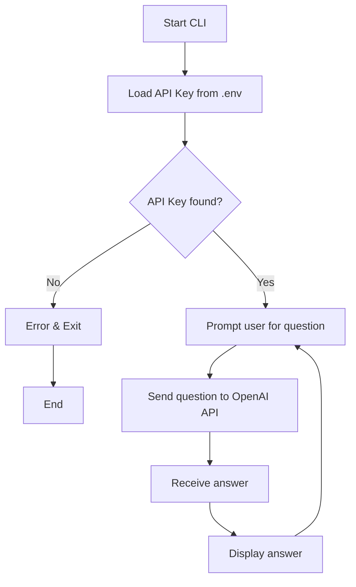

# LLM CLI Question Answering Tool (Step 1)

---

## 1. Introduction

This Python CLI tool allows you to ask natural language questions which are answered by an OpenAI large language model (GPT-4o) via a single API call.  
The program securely loads your OpenAI API key from a `.env` file and sends your question to the model, then displays the response in the terminal.  

---

## 2. Requirements

- Python 3.8+  
- OpenAI Python SDK  
- python-dotenv  

---

## 3. Setup Guide

1. **Clone the repository**  
   ```bash
   git clone https://github.com/vimu-nk/llm-cli.git
   cd llm-cli
   ```

2. **Create and activate a virtual environment (optional but recommended)**  
   ```bash
   python -m venv venv
   source venv/bin/activate  # Linux/Mac
   .\venv\Scripts\activate   # Windows PowerShell
   ```

3. **Install dependencies**  
   ```bash
   pip install -r requirements.txt
   ```

4. **Create `.env` file with your OpenAI API key**  
   ```
   OPENAI_API_KEY="sk-your-api-key"
   ```

5. **Run the CLI**  
   ```bash
   python main.py
   ```

---

## 4. How It Works

- On launch, the script loads your OpenAI API key securely from `.env`.  
- It prompts you to type a question in the terminal.  
- The question is sent to the GPT-4o model in a single chat completion API call.  
- The model’s answer is printed to the terminal.  
- You can ask multiple questions until you exit (Ctrl+C).

---

## 5. Logic and Implementation

- Uses `python-dotenv` to load environment variables without exposing keys in code.  
- Uses the official OpenAI Python client (`openai` package) to create a chat completion request.  
- The system message defines the assistant role as “helpful”.  
- User input is forwarded as the user message.  
- Response content is extracted and displayed.

---

## 6. Mermaid Flowchart



---

## 7. Weaknesses and Future Improvements

- **No error handling** for API failures or invalid inputs (currently crashes).  
- **No caching** of questions or answers; each query is a fresh API call.  
- **No rate limiting** or cost controls; could incur high usage costs.  
- **No streaming response** support for faster partial answers.  
- **No conversational memory**; each question is independent.  
- **Security risk** if `.env` is accidentally committed (must always `.gitignore` it).  
- Could add logging, input validation, and a config system.  
- Could upgrade to Flask backend for secure API handling (Step 2).  

---
